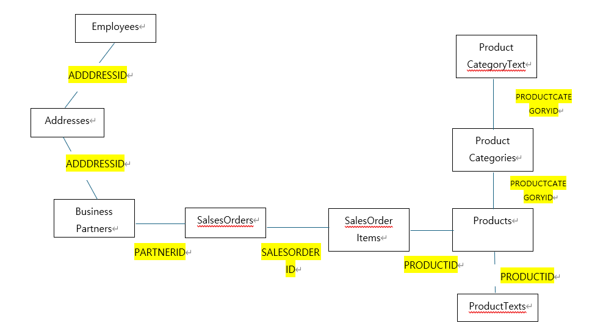

 
## Cypher 문법 예시

**Cypher Menual(https://neo4j.com/docs/cypher-manual/current/clauses/)**

**1. 노드 생성 문법**
```
LOAD CSV WITH HEADERS FROM {'file:///파일명'} AS row
CREATE (:{테이블명} {컬럼1: row.파일의 실제 컬럼1, 컬럼2: 데이터유형(row.파일의 실제 컬럼2),...});
```

**2. 엣지(관계) 생성 문법**

**참고(https://memgraph.com/blog/cypher-cheat-sheet)**

**엣지 이름은 자유롭게 생성 가능**
- 무 방향 관계 생성:
```
MATCH (a:테이블명1), (b:테이블명2)
WHERE a.컬럼 = b.컬럼
CREATE (a)-[:엣지이름]-(b);
```

- 단방향 관계 생성:
```
MATCH (a:테이블명1), (b:테이블명2)
WHERE a.컬럼 = b.컬럼
CREATE (a)-[:엣지이름]->(b);
```

- 양방향 관계 생성:
```
MATCH (a:테이블명1), (b:테이블명2)
WHERE a.컬럼 = b.컬럼
CREATE (a)-[:엣지이름]->(b), (b)-[:엣지이름]->(a);
```
**3. 전체 그래프 조회**
```
MATCH (n)
RETURN n;
```
**4. 전체 그래프 삭제**
```
MATCH (n)
DETACH DELETE n;
```

**5. 노드 이름 변경**
```
[전체 노드 변경]
MATCH (n)
SET n.name = head(labels(n))
RETURN n  
```
```
MATCH (pc:ProductCategories)
SET pc.label = "ProductCategories"
RETURN pc;
``` 

**6. 범위 내 속성과 일치하는 노드 조회**
```
MATCH (c:City)
WHERE c.population_size >= 1000000 AND c.population_size <= 2000000
RETURN c;
```

**7. 특정 관계가 있는 노드 찾기**
```
MATCH (city:City)-[:IN]-(country:Country)
WHERE city.name = "London"
RETURN country.name;
```
---------------------------

# Chyper 문법 적용 예시

**1. ProductCategoryText.csv**

노드 총 갯수: 9개 <br>
라벨: ProductCategoryText<br>

```
LOAD CSV WITH HEADERS FROM 'file:///ProductCategoryText.csv' AS row
CREATE (pct:ProductCategoryText {PRODCATEGORYID: row.PRODCATEGORYID, LANGUAGE: row.LANGUAGE, SHORT_DESCR: row.SHORT_DESCR, MEDIUM_DESCR: row.MEDIUM_DESCR, LONG_DESCR: row.LONG_DESCR});
```

**2. Products.csv**

노드: 42개 <br>
엣지: PRODCATEGORYID <br>
라벨: Products<br>

 LOAD CSV WITH HEADERS FROM 'file:///Products.csv' AS row
CREATE (p:Products {id: row.PRODUCTID, price: toFloat(row.PRICE)})
WITH p, row
MATCH (c:ProductCategories {id: row.PRODCATEGORYID})
CREATE (p)-[:BELONGS_TO]->(c); 

```
LOAD CSV WITH HEADERS FROM 'file:///Products.csv' AS row
CREATE (p:Products {PRODUCTID: row.PRODUCTID, TYPECODE: row.TYPECODE, PRODCATEGORYID: row.PRODCATEGORYID, CREATEDBY: toInteger(row.CREATEDBY), CREATEDAT: toInteger(row.CREATEDAT), CHANGEDBY: toInteger(row.CHANGEDBY), CHANGEDAT: toInteger(row.CHANGEDAT), SUPPLIER_PARTNERID: toInteger(row.SUPPLIER_PARTNERID), TAXTARIFFCODE: toInteger(row.TAXTARIFFCODE), QUANTITYUNIT: row.QUANTITYUNIT, WEIGHTMEASURE: toFloat(row.WEIGHTMEASURE), WEIGHTUNIT: row.WEIGHTUNIT, CURRENCY: row.CURRENCY, PRICE: toFloat(row.PRICE), WIDTH: toFloat(row.WIDTH), DEPTH: toFloat(row.DEPTH), HEIGHT: toFloat(row.HEIGHT), DIMENSIONUNIT: row.DIMENSIONUNIT, PRODUCTPICURL: row.PRODUCTPICURL})
WITH p, row
MATCH (pc:ProductCategories {PRODCATEGORYID: row.PRODCATEGORYID})
CREATE (p)-[:PRODCATEGORYID]->(pc),(pc)-[:PRODCATEGORYID]->(p);
```

### 3. ProductTexts.csv

노드 총 갯수: 44개 <br>
간선: `Products.csv`의 <mark>PRODUCTID</mark><br>
라벨: ProductTexts <br>

`노드 및 간선 생성`
```
LOAD CSV WITH HEADERS FROM 'file:///ProductTexts.csv' AS row
CREATE (pt:ProductText {PRODUCTID: row.PRODUCTID, LANGUAGE: row.LANGUAGE, SHORT_DESCR: row.SHORT_DESCR, MEDIUM_DESCR: row.MEDIUM_DESCR, LONG_DESCR: row.LONG_DESCR})
WITH pt, row
MATCH (p:Products {PRODUCTID: row.PRODUCTID})
CREATE (p)-[:PRODUCTID]->(pt), (pt)-[:PRODUCTID]->(p);
``` 

### 4. 특정 관계있는 노드 조회
상황: 가장 많이 팔린 제품과 해당 판매 주문들을 상위 3가지를 기준으로 그래프로 시각화
관계 테이블: Products, SalesOrderItems, SalesOrders
```
MATCH (p:Products)-[:PRODUCTID]-(s:SalesOrderItems)-[:SALESORDERID]-(o:SalesOrders)
WITH p, COUNT(s) AS SalesCount, COLLECT(o.SALESORDERID) AS SalesOrders
ORDER BY SalesCount DESC
LIMIT 3
RETURN p, SalesOrders;
```
설명: 
1. match를 관계가 있는 3개의 테이블로 잡고 엣지는 외래키로 잡음
2. with구문으로 제품별 판매된 SalesOrderItems의 갯수를 세고, SalesOrders와 연결
3. order by로 내림차순(DESC) 정렬
4. 3개까지만 보기위해 limit으로 제한
5. 제품과 연결된 모든 주문 ID를 수집하여 제일 많이 팔린 제품을 찾고 반환
결과:


**주문서까지 보고싶을 때**

[인기 제품의 전체 주문 그래프]
```
MATCH (p:Products)-[:PRODUCTID]-(s:SalesOrderItems)-[:SALESORDERID]-(o:SalesOrders)
WITH p, COUNT(s) AS SalesCount, COLLECT(o) AS SalesOrders
ORDER BY SalesCount DESC
LIMIT 1
RETURN p, SalesOrders;
```
