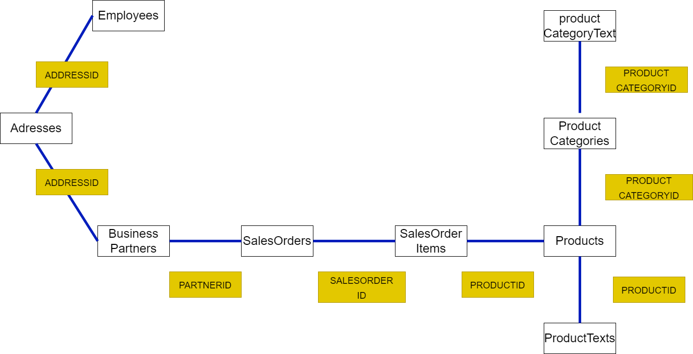

# 발표 순서

## 1. 개념적 모델링 
- 의뢰기업의 요구사항 수집 분석
- 각각의 csv파일의 정의 및 용도
- csv 파일의 관계 구조도 
## 2. 논리적 모델링
- 노드 / 엣지 / 라벨 정의
-  엣지의 방향성 정의
- property 데이터 타입 정의
## 3. 물리적 모델링
- neo4j 시스템을 활용하여 GDB관리

# 1. 개념적 모델링
## 1-1. csv파일을 통한 기업 분석

- 해당 기업은 bicycle 도매 업체로 다양한 종류의 bicycle를 판매하고 있음
- 주 비지니스 파트너 기업은 액티비티 및 bicycle 업체
- csv 파일 레코드의 대부분이 2018년에서 2019년 자료

---
## 1-2. 요구사항 수집 및 분석
- 특정 기간 비지니스 파트너들의 주문 내역을 GDB로 관리
- 상품의 판매 동향을 가시화
- AI를 적용하여 상품 카테고리, 제품 등과 비지니스 파트너의 구매패턴을 분석하여 상관관계를 도출
- 도출된 결과를 바탕으로 판매를 예측하여 사업에 적용

---
## 1-3. 모델링 시 중요사항

- 의뢰 기업에 대한 정보가 충분치 않기 때문에 최대한 CSV파일의 구조를 유지하여 설계
- 카테고리와 상품을 중심으로 비지니스 파트너의 구매내역이 잘 드러나도록 설계
---

## 1-4. csv파일의 정의 및 용도
#### 총 9개의 csv파일이 존재

### 1. `Addresses.csv`: 고용인(Employees)와 사업파트너(BusinessPartners) 의 주소

#### 주요 컬럼

    ★ADDRESSID: 주소를 식별하는 고유 ID.
    CITY: 주소가 위치한 도시.
    POSTALCODE: 우편번호.
    STREET: 거리 이름.
    BUILDING: 건물 번호.
    COUNTRY: 국가 코드 (예: US).
    REGION: 지역 코드 (예: AMER).
    ADDRESSTYPE: 주소 유형을 나타내는 코드.
    VALIDITY_STARTDATE: 주소의 유효 시작일 (YYYYMMDD 형식).
    VALIDITY_ENDDATE: 주소의 유효 종료일 (YYYYMMDD 형식).
    LATITUDE: 위도 좌표.
    LONGITUDE: 경도 좌표.

### 2. `BusinessPartners.csv`: 비지니스 파트너의 정보

#### 주요 컬럼
    ★PARTNERID: 비즈니스 파트너를 식별하는 고유 ID
    PARTNERROLE: 비즈니스 파트너의 역할을 나타내는 코드
    EMAILADDRESS: 파트너의 이메일 주소
    PHONENUMBER: 파트너의 전화번호
    FAXNUMBER: 파트너의 팩스 번호 (결측값이 많음)
    WEBADDRESS: 파트너의 웹사이트 주소
    ADDRESSID: 주소 ID로, `Addresses.csv`와 연결될 수 있는 외래 키
    COMPANYNAME: 회사 이름
    LEGALFORM: 회사의 법적 형태 (예: Inc., LLC 등)
    CREATEDBY: 레코드 생성자 ID
    CREATEDAT: 레코드 생성 날짜 (YYYYMMDD 형식)
    CHANGEDBY: 마지막으로 변경한 사용자 ID
    CHANGEDAT: 마지막으로 변경한 날짜 (YYYYMMDD 형식)
    CURRENCY: 사용되는 통화 코드 (예: USD)

### 3. `Employees.csv`: 직원 관련 정보

#### 주요 컬럼
    ★EMPLOYEEID: 직원의 고유 ID
    NAME_FIRST: 직원의 이름
    NAME_MIDDLE: 직원의 중간 이름
    NAME_LAST: 직원의 성
    NAME_INITIALS: 이름의 이니셜
    SEX: 성별 (예: M, F)
    LANGUAGE: 사용 언어 (예: E는 영어)
    PHONENUMBER: 직원의 전화번호
    EMAILADDRESS: 직원의 이메일 주소
    LOGINNAME: 직원의 로그인 이름
    ADDRESSID: 주소 ID로, `Addresses.csv`와 연결될 수 있는 외래 키
    VALIDITY_STARTDATE: 직원 정보의 유효 시작일 (YYYYMMDD 형식)
    VALIDITY_ENDDATE: 직원 정보의 유효 종료일 (YYYYMMDD 형식)

### 4. `SalesOrders.csv` : 판매 주문 정보

#### 주요 컬럼
    ★SALESORDERID: 판매 주문을 식별하는 고유 ID (`SalesOrderItems.csv`와 연결 가능)
    CREATEDBY: 레코드를 생성한 사용자 ID
    CREATEDAT: 주문 생성 날짜 (YYYYMMDD 형식)
    CHANGEDBY: 마지막으로 변경한 사용자 ID
    CHANGEDAT: 마지막으로 변경된 날짜 (YYYYMMDD 형식)
    FISCVARIANT: 회계 변형 코드
    FISCALYEARPERIOD: 회계 연도 기간
    NOTEID: 추가 노트 ID (현재 데이터에서 사용되지 않음)
    PARTNERID: 비즈니스 파트너 ID (`BusinessPartners.csv`와 연결 가능)
    SALESORG: 판매 조직 코드
    CURRENCY: 통화 코드 (예: USD)
    GROSSAMOUNT: 총 금액
    NETAMOUNT: 순 금액
    TAXAMOUNT: 세금 금액
    LIFECYCLESTATUS: 주문 생명 주기 상태 코드
    BILLINGSTATUS: 청구 상태 코드
    DELIVERYSTATUS: 배송 상태 코드

### 5. `SalesOrderItems.csv` : 판매 주문 상품 항목 정보

#### 주요 컬럼
    SALESORDERID: 판매 주문을 식별하는 고유 ID (`SalesOrders.csv`와 연결 가능)
    SALESORDERITEM: 판매 주문 내 항목 번호
    PRODUCTID: 제품을 식별하는 고유 ID (`Products.csv`와 연결 가능)
    NOTEID: 추가 노트 ID (현재 데이터에서 사용되지 않음)
    CURRENCY: 통화 코드 (예: USD)
    GROSSAMOUNT: 총 금액
    NETAMOUNT: 순 금액
    TAXAMOUNT: 세금 금액
    ITEMATPSTATUS: 항목 상태 코드
    OPITEMPOS: 운영 항목 위치 (현재 데이터에서 사용되지 않음)
    QUANTITY: 주문된 제품 수량
    QUANTITYUNIT: 수량 단위 (예: EA)
    DELIVERYDATE: 배송 날짜 (YYYYMMDD 형식)

### 6. `ProductCategories.csv` : 제품 카테고리 정보

#### 주요 컬럼
    ★PRODCATEGORYID: 제품 카테고리를 식별하는 고유 ID
    CREATEDBY: 레코드를 생성한 사용자 ID
    CREATEDAT: 레코드 생성 날짜 (YYYYMMDD 형식)

### 7. `ProductCategoryText.csv` : 제품 카테고리에 대한 세부 설명 정보

#### 주요 컬럼

    PRODCATEGORYID`: 제품 카테고리를 식별하는 고유 ID
    LANGUAGE`: 언어 코드 (예: EN)
    SHORT_DESCR`: 제품 카테고리의 짧은 설명
    MEDIUM_DESCR`: 제품 카테고리의 중간 길이 설명
    LONG_DESCR`: 제품 카테고리의 긴 설명

### 8. `Products.csv` : 제품 관련 정보

#### 주요 컬럼

    ★PRODUCTID: 제품을 식별하는 고유 ID
    TYPECODE: 제품 유형 코드
    PRODCATEGORYID: 제품 카테고리 ID (`ProductCategories.csv`와 연결 가능)
    CREATEDBY: 레코드를 생성한 사용자 ID
    CREATEDAT: 레코드 생성 날짜 (YYYYMMDD 형식)
    CHANGEDBY: 마지막으로 변경한 사용자 ID
    CHANGEDAT: 마지막으로 변경한 날짜 (YYYYMMDD 형식)
    SUPPLIER_PARTNERID: 공급업체 파트너 ID (`BusinessPartners.csv`와 연결 가능)
    TAXTARIFFCODE: 세금 코드
    QUANTITYUNIT: 수량 단위 (예: EA)
    WEIGHTMEASURE: 제품 무게
    WEIGHTUNIT: 무게 단위 (예: KG)
    CURRENCY: 가격 통화 (예: USD)
    PRICE: 제품 가격
    WIDTH, DEPTH, HEIGHT: 제품의 치수 (폭, 깊이, 높이)
    DIMENSIONUNIT: 치수 단위
    PRODUCTPICURL: 제품 이미지 URL

### 9. `ProductTexts.csv` : 제품에 대한 세부 설명 정보

    PRODUCTID: 제품을 식별하는 고유 ID (`Products.csv`와 연결 가능)
    LANGUAGE: 언어 코드 (예: EN)
    SHORT_DESCR: 제품의 짧은 설명
    MEDIUM_DESCR: 제품의 중간 길이 설명
    LONG_DESCR: 제품의 긴 설명
---

## 1-5. 각 csv 파일들의 관계

#### `Employees` <`1`---ADDRESSID --`1`> `Addresses`
---
#### `BusinessPartners` <`1`---ADDRESSID---`1`> `Addresses`
#### `BusinessPartners` <`1`---PARTNERID---`N`> `SalesOrders`
---
#### `SalesOrders` <`1`---SALESORDERID---`N`> `SalesOrderItems`
---
#### `SalesOrderItems` <`N`---PRODUCTID---`1`> `Products`
---
#### `Products` <`1`---PRODUCTID---`1`> `ProductTexts`
#### `Products` <`N`---PRODCATEGORYID---`1`> `ProductCategories`
---
#### `ProductCategories`<`1`---PRODCATEGORYID---`1`> `ProductCategoryText`

---

### 설명
1. `직원`들에 대한 csv 파일이 있다.
1. `비니지스 파트너`들에 대한 csv 파일이 있다.
1. `의뢰 기업`과 `비지니스 파트너`들의 `주소`에 대한 csv파일이 있다.
1. `상품` ,`카테고리` csv파일과 세부 정보를 담은 csv파일이 있다.
1. `비지니스 파트너`들이 주문한 `판매 주문` csv파일이 있다.
1. `판매 주문`에 따른 세부 정보를 담은 `판매 주문 아이템` csv파일이 있다.
1. `판매 주문 아이템`은 `상품`csv파일을 참조하여 어떤 상품을 주문했는지 알 수 있다.

---
### 중요 포인트
- 비지니스 파트너가 주문한 상품에 대한 정보가 잘 드러나는게 좋을 것 같음

### 전체적인 구조도

# 2. 논리적 모델링

## 2-1. 노드 정의
- CSV 파일의 구조를 유지하기 위해 각 CSV파일의 `객체(컬럼)`을 `노드`로 정의  
    - `Addresses.csv` --> 54개 노드 생성
    - `Employees.csv` --> 14개 노드 생성
    - `BusinessPartners.csv` -->  40개 노드 생성
    - `SalesOrders.csv` --> 334개 노드 생성
    - `SalesOrderItems.csv` --> 1930개 노드 생성
    - `Products.csv` --> 42개 노드 생성
    - `ProductTexts.csv` --> 44개 노드 생성
    - `ProductCategories.csv` --> 9개 노드 생성
    - `ProductCategoryText.csv` --> 9개 노드 생성

- 특이사항: `Products.csv`의 데이터가 `productTexts.csv` 데이터보다 두개 많음

## 2-2 속성 정의
- CSV파일의 구조를 유지하기 위해 각 CSV파일의 `속성(열)`의 값을 `노드의 속성`으로 정의
- 각 CSV파일에 포함된 속성은 `1-4. csv파일의 정의 및 용도` 참고

## 2-3 라벨 정의
- 각 CSV 파일 별 각각의 객체를 노드로 잡았으므로, 라벨은 CSV파일 파일명으로 그룹화 해서 처리
- 예) `Addresses.csv`파일의 54개의 노드의 라벨명은 `Addresses`로 정의  
`Employees.csv`파일의 14개의 노드의 라벨명은 `Employees`로 정의

- 추후 추가 요구사항 발생 시 속성의 변동은 유동적으로 처리

## 2-4 엣지(관계) 정의
- CSV 파일의 구조를 유지하기 위해 각 CSV파일의 `참조 관계`를 추출하고 `해당 속성`이 `같은` 것 끼리 `엣지 생성`
- 해당 내용은 `전체적인 구조도` 참고
- 필요 시 엣지 명은 유동적으로 작명

## 2-5 엣지 방향 정의
- 각 csv파일이 의미하는 내용을 기반으로 논리적인 관계에 따라 엣지 의미를 정의하고, 이에 맞추어 방향을 생성하는 것이 좋을 것 같음
    - BusinessPartners 와 SalesOrders의 관계의 경우, 엣지의 의미가 `주문함` 이라면 BusinessPartners->SalesOrders의 가 될 것이고, 엣지의 의미가 `주문됨` 이라면 SalesOrders -> BusinessPartners 이 될

## 속성의 데이터 타입 정의

- 속성의 데이터 타입 정의 시 `룰`을 정하고 `데이터 형식`에 따라 `룰을 적용`하는게 `일관성 유지`에 좋을 것으로 생각됨

- 룰
    - 해당 속성의 모든 데이터 타입이 정수 -> 정수형
    - 해당 속성의 모든 데이터 타입이 하나라도 실수 -> 실수형
    - 해당 속성의 모든 데이터 타입이 문자인 경우 -> 문자형
    - 해당 속성의 모든 데이터 타입이 날짜형식인  경우 -> DATE형

- 위에 방식대로 `룰`에 의해 데이터 타입을 지정하고, 이후 `데이터의 의미`를 분석하여 추가적인 데이터 타입 정의
    - 데이터 형식은 모두 실수였으나, 의미하는 바가 좌표값이라면 --> 위도와 경도의 의미를 갖으므로 둘을 합쳐서 Point 타입으로 재정의

# 3. 물리적 모델링

- Neo4j DBMS 사용

- csv 파일 - ONNX 변환 - Neo4j에 저장

- 아래 사진은 CSV파일을 NEO4j에 다이렉트로 저장한 사진

